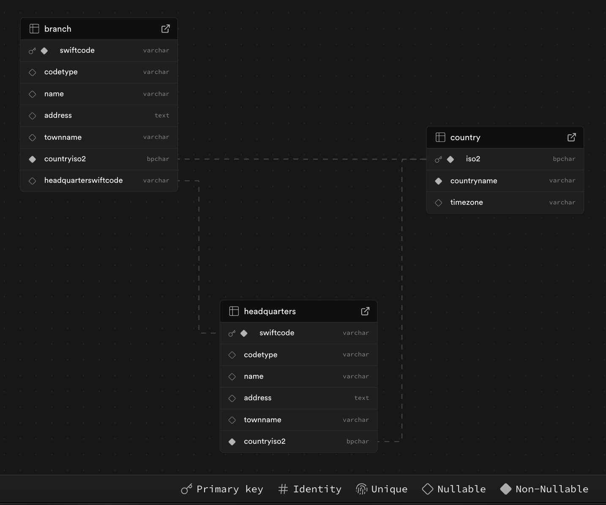

SWIFT Codes API - Remitly 2025 Internship Exercise
==================================================

A repository containing the technical task for the Remitly 2025 Summer Internship.

Environment
--------------

-   **OS**: macOS Sequoia 15.0

-   **Docker**: 24.0.7

-   **Node.js**: 23.6.1

-   **TypeScript**: 5.8.2

🚀 Setup & Installation
-----------------------

### 1️⃣ Clone the repository:

```
git clone https://github.com/Wojtke7/Remitly2025.git
cd Remitly2025
```

🛠️ Building & Running the Application
--------------------------------------

### 1️⃣ Build the Docker image (includes tests):

```
docker compose build --no-cache
```

### 2️⃣ Run the application:

```
docker compose up
```

### 3️⃣ Fix execution permissions (if needed):

If you encounter an error related to script execution permissions, apply the following fix:

```
cd backend
chmod +x entrypoint.sh
```
*** 

## 🗄️ Database Schema  
Below is the entity-relationship diagram (ERD) of the database structure:



The database contains three main entities:

- **Country**: Contains country details (e.g., ISO2 code, country name, time zone).
- **Headquarters**: Represents a bank's headquarter with associated details (e.g., SWIFT code, address, and branches).
- **Branch**: Represents a branch of a bank and its relation to the headquarter.

* * * * *

📡 API Endpoints
----------------

### 1️⃣ Import Data from Excel to PostgreSQL

-   **Endpoint**: `POST /v1/swift-codes/parse`

-   **Description**: Parses a specified Excel file and inserts the data into the database.

-   **Example Usage**:

```
curl -X POST "http://localhost:8080/v1/swift-codes/parse?filePath=static/swift.xlsx"
```

-   **Expected Response**:

```
{
  "message": "Data inserted successfully"
}
```

* * * * *

### 2️⃣ Retrieve SWIFT Code Details

-   **Endpoint**: `GET /v1/swift-codes/{swiftCode}`

-   **Description**: Retrieves details of a headquarter SWIFT code along with its associated branches (if applicable). If the provided SWIFT code belongs to a branch, only its details are returned.

#### Example: Retrieving Headquarter Details

```
curl -X GET "http://localhost:8080/v1/swift-codes/SECTCLR1XXX" -H "Content-Type: application/json"
```

-   **Expected Response:**

```
{
    "address": "AVDA. AMERICO VESPUCIO SUR 100 OFICINA 102 LAS CONDES - SANTIAGO PROVINCIA DE SANTIAGO, 8320000",
    "bankName": "SAMSUNG ELECTRONICS CHILE LIMITADA (LTDA)",
    "countryISO2": "CL",
    "countryName": "CHILE",
    "isHeadquarter": true,
    "swiftCode": "SECTCLR1XXX",
    "branches": [
        {
            "address": "AVDA. AMERICO VESPUCIO SUR 100 OFICINA 102 LAS CONDES - SANTIAGO PROVINCIA DE SANTIAGO, 8320000",
            "bankName": "SAMSUNG ELECTRONICS CHILE LIMITADA (LTDA)",
            "countryISO2": "CL",
            "countryName": "CHILE",
            "isHeadquarter": false,
            "swiftCode": "SECTCLR1850"
        }
    ]
}
```

#### Example: Retrieving Branch Details

```
curl -X GET "http://localhost:8080/v1/swift-codes/SECTCLR1850" -H "Content-Type: application/json"
```

-   **Expected Response:**

```
{
    "address": "AVDA. AMERICO VESPUCIO SUR 100 OFICINA 102 LAS CONDES - SANTIAGO PROVINCIA DE SANTIAGO, 8320000",
    "bankName": "SAMSUNG ELECTRONICS CHILE LIMITADA (LTDA)",
    "countryISO2": "CL",
    "countryName": "CHILE",
    "isHeadquarter": false,
    "swiftCode": "SECTCLR1850"
}
```

* * * * *

### 3️⃣ Retrieve Data by Country

-   **Endpoint**: `GET /v1/swift-codes/country/{countryISO2code}`

-   **Description**: Retrieves all SWIFT codes associated with a given country.

-   **Example Usage**:
  
```
curl -X GET "http://localhost:8080/v1/swift-codes/country/PL" -H "Content-Type: application/json"
```

-   **Expected Response**: A JSON object containing country details and a list of associated SWIFT codes. *(Response omitted for brevity.)*

* * * * *

### 4️⃣ Add a New SWIFT Code

-   **Endpoint**: `POST /v1/swift-codes`

-   **Description**: Adds a new SWIFT code entry, differentiating between a headquarter and a branch.

-   **Example Usage:**

```
curl -X POST "http://localhost:8080/v1/swift-codes"\
     -H "Content-Type: application/json"\
     -d '{
       "address": "Marszałkowska 10, Warszawa",
       "bankName": "Bank Polska SA",
       "countryISO2": "PL",
       "countryName": "Poland",
       "isHeadquarter": true,
       "swiftCode": "BPOLPLPWXXX"
     }'
```

-   **Expected Response:**

```
{
  "message": "Bank headquarter created successfully."
}
```

or, if adding a branch:

```
{
  "message": "Bank branch created successfully."
}
```

* * * * *

### 5️⃣ Delete a SWIFT Code

-   **Endpoint**: `DELETE /v1/swift-codes/{swiftCode}`

-   **Description**: Deletes the specified SWIFT code from the database, differentiating between a headquarter and a branch.

-   **Example Usage:**

```
curl -X DELETE "http://localhost:8080/v1/swift-codes/BPOLPLPWXXX" -H "Accept: application/json"
```

-   **Expected Response:**

```
{
    "message": "Headquarter with swiftCode BPOLPLPWXXX has been deleted."
}
```

* * * * *

📌 Notes
--------

-   Ensure Docker is running before executing any commands.

-   If you encounter permission issues, check the script execution rights.
